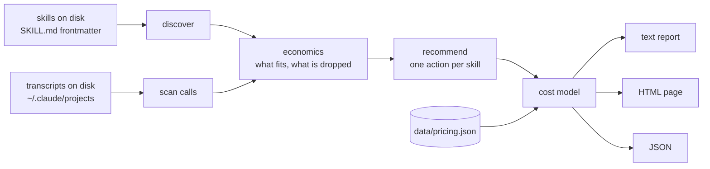
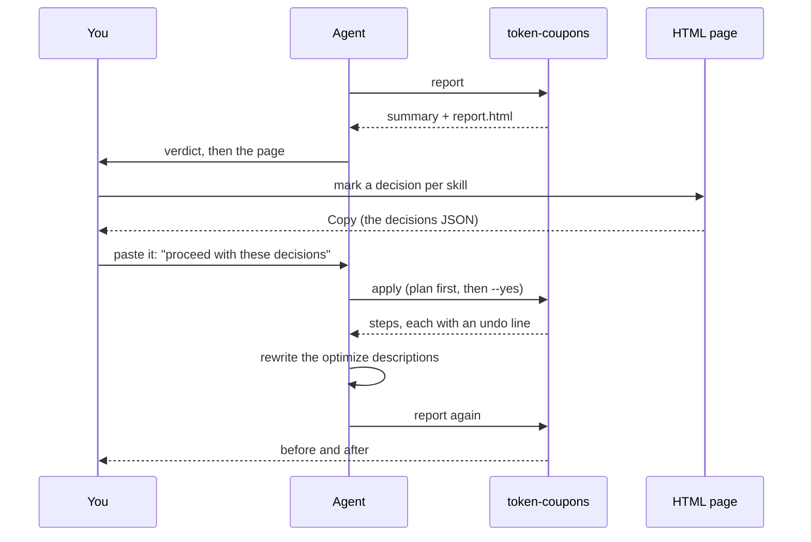

# token-coupons

Find out what your installed agent skills cost on every message, which ones the agent never reads, and what to do about it.

[](https://www.npmjs.com/package/token-coupons)
[](LICENSE)
[](package.json)

## The problem in 20 seconds

Every skill you install carries a description. The agent client puts a listing of every installed skill, name plus description, into the system prompt, and re-sends it with every single API call. Install 200 skills and you are paying for 200 descriptions on every message of every chat, whether or not any of them get used.

That listing has a budget you never see. Claude Code gives it about 1 percent of the context window. When the listing goes over, the client keeps every name but starts dropping descriptions, least-invoked first, until the rest fits. A skill with no description in the listing cannot be picked by the agent on its own. It is installed, it is correct, and it is unreachable, and nothing anywhere prints an error.

`token-coupons` reads the skills on your disk and the session transcripts already on your disk, and tells you: what the listing costs per message, which skills have never once been chosen, which ones are being dropped right now, what the waste costs in dollars per week and per month on the model you actually use, and one recommended action per skill. It counts only what Claude Code actually lists from where you run it (your `~/.claude/skills`, the current project's `.claude/skills`, and enabled plugins); everything else on disk is shown separately and costs nothing.

## Quick start

Print the report. Nothing is changed on disk.

```bash
npx token-coupons@latest report
```

Working from a clone, or on a machine where `npx` cannot reach the registry? Use `node bin/token-coupons.mjs` in place of `npx token-coupons@latest` in every command below.

Write the interactive page and open it in your browser.

```bash
npx token-coupons@latest report --html=report.html --open
```

In the page, every row starts on the recommendation. Change the rows you disagree with, then press Copy on the decisions box at the bottom. If an agent is driving, paste that JSON into your next message and say "proceed with these decisions". By hand, save it as `decisions.json` and carry it out yourself: once without `--yes` to read the plan, then again with `--yes`.

```bash
npx token-coupons@latest apply decisions.json         # prints the plan, writes nothing
npx token-coupons@latest apply decisions.json --yes   # makes the changes
```

`apply -` reads the same JSON from stdin, so `pbpaste | npx token-coupons@latest apply -` works too.

## What you get

Real output from the author's machine, trimmed to fit here (`report --since=2026-06-01 --no-color`):

```text
token-coupons v0.1.0 (generated 2026-08-15, sessions since 2026-06-01, 159 sessions read)

WHAT THE LISTING COSTS
  Skills in your listing: 92 (92 let the agent pick them, 0 start only when you type their name)
                          plus 94 on disk but not listed, see ON DISK, NOT LISTED
  Allowance for the list: 40,000 characters, about 10,000 tokens (1 percent of a 1,000,000 token window)
  The list right now:     42,910 characters of descriptions, about 10,728 tokens
  Sent with every message: about 10,728 tokens
  Over the allowance by 2,910 characters (1.07x). Past that line the client drops descriptions
  quietly, least used first, so those skills cannot be found by the agent.

  66    never used, but described on every message  7,225 tokens per message
  3     cannot be reached (their description is being dropped to fit)
  7     only ever started by you typing their name  689 tokens per message

  Set those 73 skills to start only when you type their name and you save about 7,467 tokens on
  every message, and the list fits its allowance again.

WHAT IT COSTS IN DOLLARS
  15,238,064 tokens wasted per week, 66,031,611 per month, from 7,913 unused tokens riding in every message.

    model                     wasted/week  wasted/month  uncached/week  whole list/month
  * Claude Opus 5                   $8.72        $37.80         $76.19            $51.29
  * Claude Sonnet 5                 $3.49        $15.12         $30.48            $20.52
    GPT-5.6 Sol                     $8.14        $35.28         $76.19            $47.87
  * seen in your own sessions
  Assumes 131 messages per chat and 14.7 chats per week, measured from your sessions.
  Share of everything you send: the list is 1.99 percent of your input, the wasted part is 1.47 percent.

RECOMMENDED
  48 to gate (active), 25 to delete, 8 to rewrite (optimize), 11 to keep

   #  action    saves/msg  skill
   1  delete          384  typescript-e2e-testing
       Never used, last edited 148 days ago, 2,327 chars sent every message.
   2  active          286  app-review
       Never used in these sessions, yet its 1,143 chars description costs 290 tokens a message.
```

Reading the arithmetic in that block: 7,225 plus 689 is what those 73 descriptions spend today, and gating a skill still leaves its name line in the listing, so the saving is 7,467 rather than the full 7,914. The 3 that cannot be reached are counted inside the 66, not on top of them. The 94 "on disk but not listed" are skills Claude Code does not load from this folder (other projects, plugin source repos, disabled plugins, folders other tools read), so they are listed at the bottom for completeness and cost nothing.

The full report has these sections: what the listing costs, what it costs in dollars, recommended (every skill ranked by how much it saves, with one short reason each), heaviest descriptions, thin descriptions, never called, called (with uses split into agent picked and you typed), on disk but not listed, and calls in your transcripts that match nothing installed today.

## How it works



The decision loop, with the bundled skill driving it:



## The three numbers

**Never called** means the agent has not once chosen this skill in the sessions read, while its description still goes out with every message.

**Cannot be reached (unroutable)** means the listing is over its allowance and this skill's description is one the client is dropping, so the agent cannot pick it at all until something shrinks.

**Only ever started by you typing its name (summoned only)** means the skill does get used, but never by the agent's own choice, so its description in the listing buys nothing.

### The cost model

- Prices assume caching by default, because that is how these clients run: the listing is stored once per chat and re-read on later messages.
- The first message of a chat pays the cache write rate; every message after it pays the cache read rate. `--uncached` prices the worst case, where nothing is cached.
- Messages per chat and chats per week are measured from your own transcripts. When no history is found, the report says the numbers were assumed instead.
- On a subscription, dollars are the wrong unit, so the report also gives the listing as a share of everything you send.
- Prices are a data file (`data/pricing.json`) with a verified-on date, never code, and the report says so when that date is more than 60 days old.

## Conventions

| Mode | In the skill's SKILL.md | What is sent every message |
| --- | --- | --- |
| Passive (the default) | no `disable-model-invocation` line | the name and the whole description |
| Active | `disable-model-invocation: true` | the name line only; you start it by typing its name |

| Action | When it is recommended | What `apply` does | Undo |
| --- | --- | --- | --- |
| `keep` | it gets used and its description is a reasonable size | nothing, it is left out of the plan | nothing to undo |
| `active` | never used, or only ever started by name | sets `disable-model-invocation: true` in SKILL.md | delete that line |
| `passive` | you want the agent to be able to pick it again | removes that line | add the line back |
| `optimize` | used, but the description is over 600 characters or past the per entry cap, or never used and too thin to route to | changes no file; puts the skill on a worklist with a target of about 350 characters | nothing to undo |
| `delete` | never used, in a folder you own, and not edited in 90 days | unlinks the shortcut under `~/.claude/skills`, or moves the folder into the trash folder | `ln -s` it back, or move the folder back |
| `review` (report only) | already active, never used; costs one name line | not an action you send back: answer it with one of the five above | nothing |

Plugin skills are a special case: the installed copy lives in the plugin cache and is overwritten on the next update. When the plugin's source repo is on your machine, `apply` edits that source copy instead and tells you to run `claude plugin update`; when it is not, the cache copy is edited with a warning.

## Use it from your agent

The repo ships an Agent Skill at `skills/token-coupons` that runs the whole loop above. Install it either way:

```bash
# Claude Code: this repo is a plugin marketplace with one plugin
claude plugin marketplace add steve-piece/token-coupons
claude plugin install token-coupons@token-coupons

# or, from a clone, point your skills folder at the copy in this repo
ln -s "$PWD/skills/token-coupons" ~/.claude/skills/token-coupons
```

Then say `/token-coupons`. The agent runs the report, leads with one verdict line, hands you the HTML page, and stops. Nothing on disk changes while it waits. Mark your decisions in the page, press Copy, and paste the JSON into your next message with "proceed with these decisions". The agent runs `apply` without `--yes` first and shows you the plan, asks, then runs it, rewrites the descriptions marked `optimize`, re-runs the report, and closes with before and after.

The skill itself ships with `disable-model-invocation: true`, so it only ever runs when you ask for it.

## CLI reference

```text
token-coupons report [--since=YYYY-MM-DD] [--window=N] [--fraction=F] [--budget=CHARS]
                     [--pricing=FILE] [--uncached] [--json] [--html=FILE] [--out=FILE]
                     [--open] [--no-color] [--cwd=DIR]
token-coupons apply <decisions.json | -> [--yes] [--trash=DIR] [--json]
token-coupons pricing [--pricing=FILE] [--json]
token-coupons help

  --since=DATE     only read sessions on or after this day
  --cwd=DIR        count a project's own skills as listed from this folder (default: where you run it)
  --window=N       context window size in tokens, instead of reading it from your settings
  --fraction=F     share of the window the listing may use (default 0.01)
  --budget=CHARS   a fixed allowance in characters, which wins over --fraction
  --pricing=FILE   a price list to use instead of the bundled data/pricing.json
  --uncached       price the worst case, where nothing is cached
  --json           print JSON instead of text
  --html=FILE      also write the interactive page
  --out=FILE       also write the report JSON
  --open           open the HTML page in your browser after writing it
  --no-color       plain text without colors
  --yes            apply only: actually make the changes
  --trash=DIR      apply only: where deleted folders go (default ~/.token-coupons/trash)
```

`report` exits 0 when it finishes. `apply` exits 1 if a step failed, 0 otherwise; refusals are not failures. An unknown flag or command exits 2.

## Privacy and safety

- Local files only. It reads your skill folders (`~/.claude/skills`, `~/.agents/skills`, `~/.cursor/skills`, plugin marketplaces and caches, and a shallow pass over `~/Projects`), your session transcripts under `~/.claude/projects`, and `~/.claude/settings.json` (plus `settings.local.json`) for the model you run.
- No network access, ever. Prices ship as a data file with a date on them; refreshing them is a human action, not a fetch.
- `report` writes nothing unless you pass `--html` or `--out`.
- `apply` writes nothing without `--yes`, and nothing it does is unrecoverable: shortcuts under `~/.claude/skills` are unlinked rather than followed, folders are moved to `~/.token-coupons/trash/<timestamp>` rather than erased, and copies owned by the plugin cache are refused with the `claude plugin uninstall` command to run instead. Every step prints its own undo line.
- Set `TOKEN_COUPONS_HOME` to point the whole tool at a different home directory.

## Contributing

```bash
pnpm test                    # node --test, no dependencies to install
node tests/dash-scan.mjs     # fails on any em dash or en dash in the repo
```

One rule that trips everyone up: no em dashes or en dashes anywhere in this repo, including code, comments, strings, docs, and the generated HTML. Use commas, colons, parentheses, or periods. Run the dash scan before you open a pull request.

Node 20 or newer. Zero runtime dependencies, and it stays that way.

## License

MIT. See [LICENSE](LICENSE).
