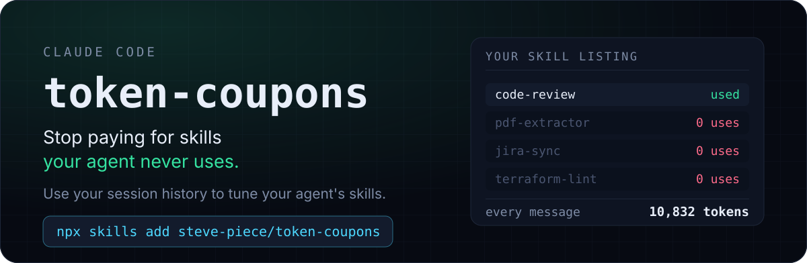
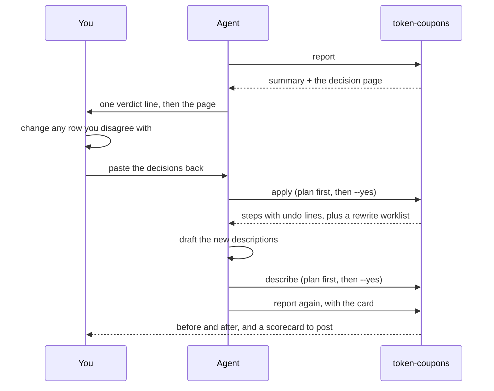
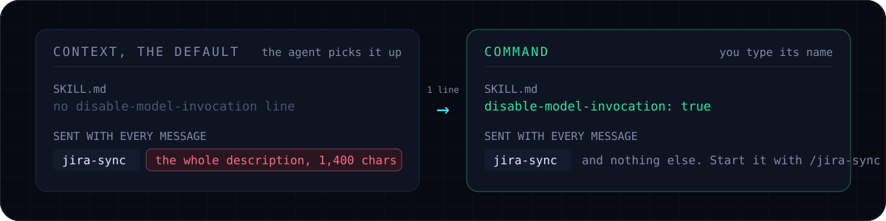

<p align="center">
  
</p>

<p align="center">
  <a href="https://github.com/steve-piece/token-coupons/actions/workflows/test.yml"></a>
  <a href="LICENSE"></a>
  
  
  
</p>

## What it tells you

Real output, from the author's machine, trimmed to fit:

```text
WHAT THE LISTING COSTS
  Skills in your listing: 99 (98 let the agent pick them, 1 starts only when you type its name)
  Allowance for the list: 40,000 characters, about 10,000 tokens (1 percent of a 1,000,000 token window)
  Sent with every message: about 11,485 tokens
  Over the allowance by 5,908 characters (1.15x). Past that line Claude Code drops descriptions
  quietly, least used first, so those skills cannot be found by the agent.

  66    never used, but described on every message  7,181 tokens per message
  6     cannot be reached (their description is being dropped to fit)
  7     only ever started by you typing their name    689 tokens per message

  Set those 73 skills to start only when you type their name and you save about 7,427 tokens
  on every message, and the list fits its allowance again.

WHAT IT COSTS IN DOLLARS
    model                     wasted/week  wasted/month  uncached/week  whole list/month
  * Claude Fable 5                 $26.81       $116.19        $173.18           $169.58
  * Claude Opus 5                  $13.41        $58.09         $86.59            $84.79
  * Claude Sonnet 5                 $5.36        $23.24         $34.64            $33.92
  * seen in your own sessions
  Assumes 131 messages per chat and 16.8 chats per week, measured from your sessions.

RECOMMENDED
  41 to gate (active), 25 to delete, 10 to rewrite (optimize), 23 to keep

   #  action    saves/msg  skill
   1  delete          384  typescript-e2e-testing
       Never used, last edited 151 days ago, 2,327 chars sent every message.
   2  active          286  app-review
       Never used in these sessions, yet its 1,143 chars description costs 290 tokens a message.
```

Then it hands you a page where every row is already set to what it recommends, you change the ones you disagree with, and it carries out your decisions.

## Why this happens

Every skill carries a description. Claude Code puts a listing of every installed skill, name plus description, into the system prompt and re-sends it on **every single API call**. Two hundred skills means two hundred descriptions on every message of every chat, used or not.

That listing has a budget you never see: about 1 percent of the context window. When it overflows, Claude Code keeps every name and starts dropping **descriptions**, least-invoked first, until the rest fits. A skill with no description in the listing cannot be chosen by the agent at all.

It is installed. It is correct. It is unreachable. Nothing anywhere prints an error.

Three numbers follow, and the report leads with whichever is worst:

| The number | What it means |
| --- | --- |
| **Never called** | The agent has never chosen it, and its description still ships with every message |
| **Cannot be reached** | The listing is over its allowance and this description is one of the ones being dropped |
| **Summoned only** | It is used, but only when you type its name, so its description buys nothing |

## Install

```bash
npx skills add steve-piece/token-coupons
```

Then say `/token-coupons` in Claude Code. Node 20 or newer is the only requirement: no dependencies, no build step, no network.

<details>
<summary>Other ways in</summary>

```bash
# Claude Code plugin: this repo is a marketplace with one plugin
claude plugin marketplace add steve-piece/token-coupons
claude plugin install token-coupons@token-coupons
```

```bash
# from a clone, point your skills folder at the copy in this repo
git clone https://github.com/steve-piece/token-coupons
ln -s "$PWD/token-coupons/skills/token-coupons" ~/.claude/skills/token-coupons
```

</details>

## The loop



Nothing on disk changes while it waits for you. The agent runs `apply` without `--yes` first and shows you the plan, asks, then runs it.

## What it can change, and how to undo it

Two modes, a distinction this tool draws, and the whole job is deciding which one each skill belongs in.

<p align="center">
  
</p>

| Mode | SKILL.md line | Sent every message |
| --- | --- | --- |
| **Passive** (default) | none | name and full description; the agent picks it up as needed |
| **Active** | `disable-model-invocation: true` | name only; a workflow you start by typing its name |

| Action | When | What it does | Undo |
| --- | --- | --- | --- |
| `keep` | used, description a fair size | nothing | nothing |
| `active` | never used, or only started by name | adds the line | delete the line |
| `passive` | you want the agent picking it again | removes the line | add it back |
| `optimize` | used, but oversized or past the cap | queues it for `describe` | `cp` the copy `describe` kept |
| `delete` | never used, yours, untouched 90 days | unlinks the shortcut, or moves the folder to trash | `ln -s` or move it back |
| `review` | already active, never used | nothing: pick one of the five above | nothing |

Nothing is unrecoverable. Shortcuts are unlinked rather than followed. Folders move to `~/.token-coupons/trash/<timestamp>` rather than being erased. A file about to have its description replaced is copied there first. Copies owned by the plugin cache are refused outright, with the `claude plugin uninstall` command to run instead. Every step prints its own undo line.

Rewriting a description is the one job that needs a model, so it is the one job the tool leaves to the agent. `apply` hands back a worklist, the agent drafts the words, and `describe` files them, replacing that one key and leaving every other line untouched.

## Where the numbers come from

- **Caching is priced the way Claude Code really runs it.** The listing sits at the front of the cached prefix, so it is paid at the cache-write rate whenever that prefix is invalidated (chat start, model switch, effort switch, or a gap longer than the cache lifetime) and at a tenth of input the rest of the time. A `/compact` is not one of those. How often it happens is measured from your own transcripts.
- **Messages per chat and chats per week are measured**, not assumed. When no history is found, the report says so instead of guessing.
- **On a subscription, dollars are the wrong unit**, so the report also gives the listing as a share of everything you send.
- **Prices are a data file** with a verified-on date, never code, and the report warns you when that date is more than 60 days old.

<details>
<summary>Two runs a week apart should be comparable</summary>

A report is only as steady as its inputs, and two of them change without you noticing: the folder you ran it from, which decides whose project skills count as listed, and how far back it read. So every run leaves a small record in `~/.token-coupons/runs`, and the next one reads it.

**Settings carry forward.** Ask for `--since=2026-06-01` once and every later report reads the same stretch of history without being told again. Anything you do type wins. Flags that only decide what gets written (`--html`, `--card`, `--out`) are deliberately not remembered.

**The report says what moved.** A `SINCE YOUR LAST RUN` block appears when the folder changed, skills came or went, or a headline number moved by more than a fifth. Silence there means the two runs measured the same thing.

`--fresh` skips both. History is thirty records deep, about 7 KB each, and it lives outside the skill folder on purpose: a plugin update replaces the plugin cache and `skills update` re-copies an installed skill, so history kept there would be wiped by the very event it exists to survive.

</details>

## Driving it yourself

Everything the skill runs is a command you can run.

```bash
TC() { node "$HOME/.claude/skills/token-coupons/bin/token-coupons.mjs" "$@"; }

TC report                                  # print it, change nothing
TC report --html=report.html --open        # the decision page
TC report --card=scorecard.html --open     # the shareable card, exports itself as a PNG
TC apply decisions.json                    # the plan, writes nothing
TC apply decisions.json --yes              # make the changes
```

`apply -` and `describe -` read the same JSON from stdin, so `pbpaste | TC apply -` works too.

<details>
<summary>Full CLI reference</summary>

```text
token-coupons report [--since=YYYY-MM-DD] [--cwd=DIR] [--window=N] [--fraction=F] [--budget=CHARS]
                     [--pricing=FILE] [--uncached] [--cache-ttl=MIN] [--json] [--html=FILE]
                     [--card=FILE] [--out=FILE] [--open] [--no-color] [--fresh] [--runs=DIR]
token-coupons apply <decisions.json | -> [--yes] [--trash=DIR] [--json]
token-coupons describe <descriptions.json | -> [--yes] [--trash=DIR] [--json]
token-coupons pricing [--pricing=FILE] [--json]
token-coupons help

  --since=DATE     only read sessions on or after this day
  --cwd=DIR        count a project's own skills as listed from this folder (default: where you run it)
  --window=N       context window size in tokens, instead of reading it from your settings
  --fraction=F     share of the window the listing may use (default 0.01)
  --budget=CHARS   a fixed allowance in characters, which wins over --fraction
  --pricing=FILE   a price list to use instead of the bundled one
  --uncached       price the worst case, where nothing is cached
  --cache-ttl=MIN  minutes the saved prompt survives with no messages (default 60, the Claude
                   subscription behaviour; use 5 on a plain API key)
  --json           print JSON instead of text
  --html=FILE      also write the decision page
  --card=FILE      also write the shareable card
  --out=FILE       also write the report JSON
  --open           open the page in your browser after writing it
  --no-color       plain text without colors
  --fresh          ignore the last run: carry nothing forward, compare nothing
  --runs=DIR       where run history is kept (default ~/.token-coupons/runs)
  --yes            apply and describe only: actually make the changes
  --trash=DIR      apply and describe only: where deleted folders and replaced files go
```

`report` exits 0 when it finishes. `apply` and `describe` exit 1 if a step failed, 0 otherwise; refusals are not failures. An unknown flag or command exits 2.

</details>

## Privacy

- **Local files only**, and only the ones Claude Code itself reads: your skill folders, your session transcripts under `~/.claude/projects`, and `~/.claude/settings.json` for the model you run. Folders belonging to other tools are never opened.
- **No network access, ever.** Prices ship as a data file with a date on them; refreshing them is a human action, not a fetch.
- **`report` writes nothing** beyond the paths you give it and its own run record.
- Set `TOKEN_COUPONS_HOME` to point the whole tool at a different home directory.

## Contributing

```bash
pnpm test                    # node --test, no dependencies to install
node tests/dash-scan.mjs     # fails on any em dash or en dash in the repo
```

The whole tool is `skills/token-coupons`, and `tests/` at the repo root reaches into it. Nothing the tool needs at runtime may live outside that directory: `skills add` copies it on its own, and anything left behind would simply be missing. [docs/architecture.md](docs/architecture.md) is the contract every module is written against; change it there first.

One rule that trips everyone up: no em dashes or en dashes anywhere in this repo, including code, comments, strings, docs, and generated HTML. Run the dash scan before you open a pull request.

## License

MIT. See [LICENSE](LICENSE).
