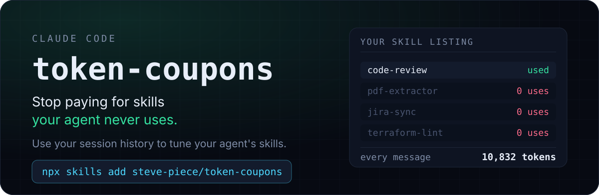
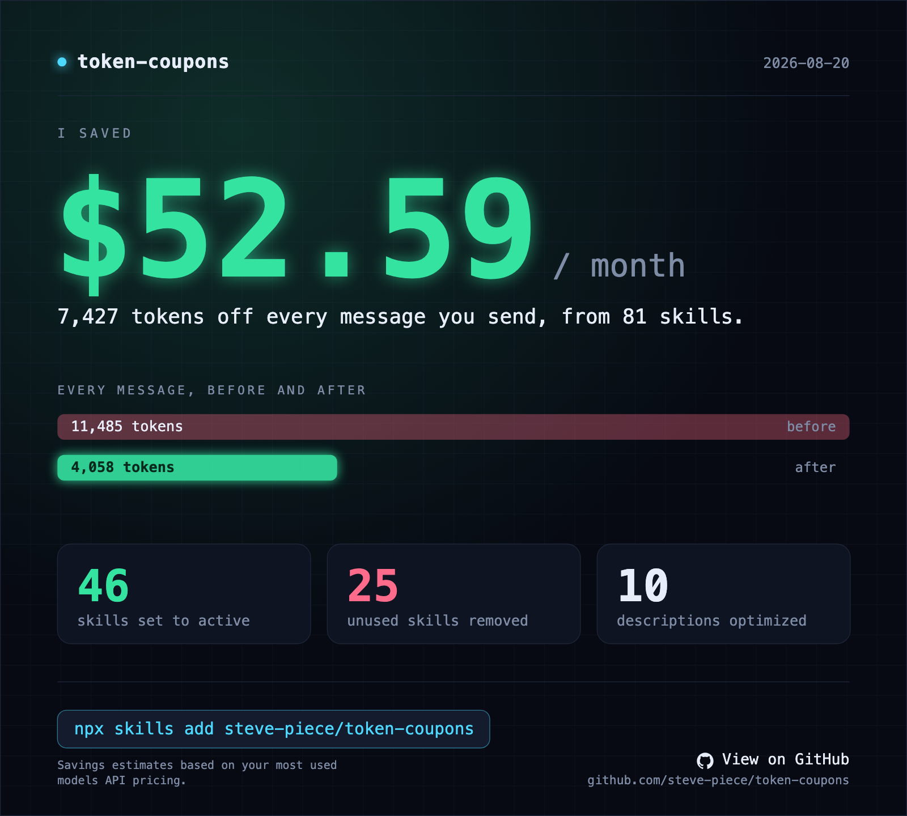
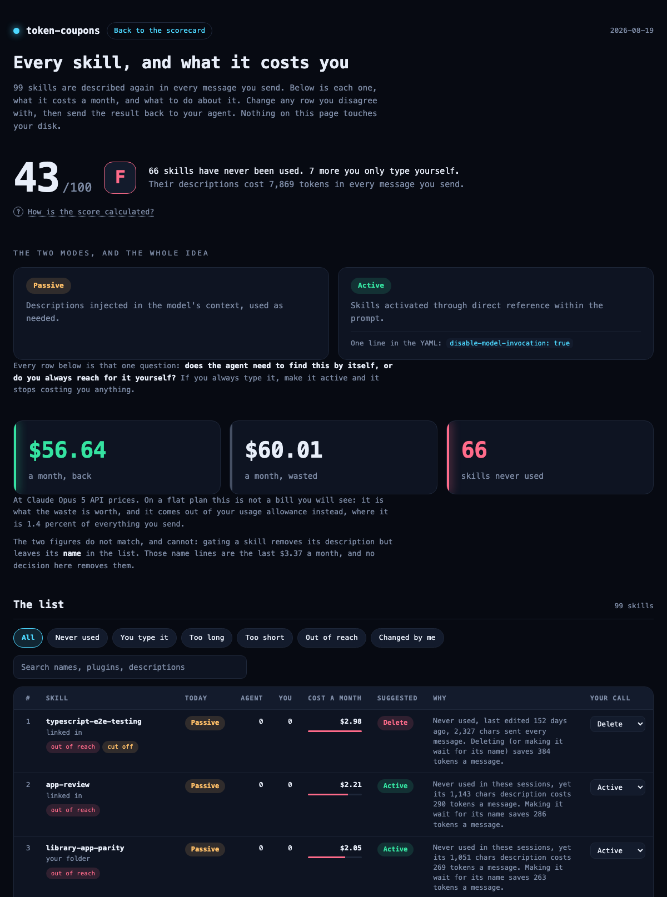
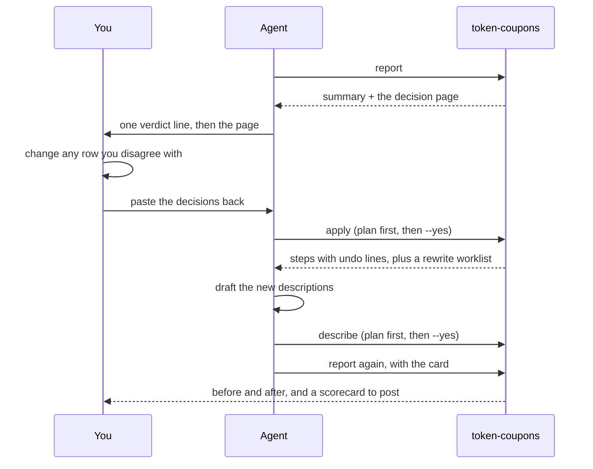
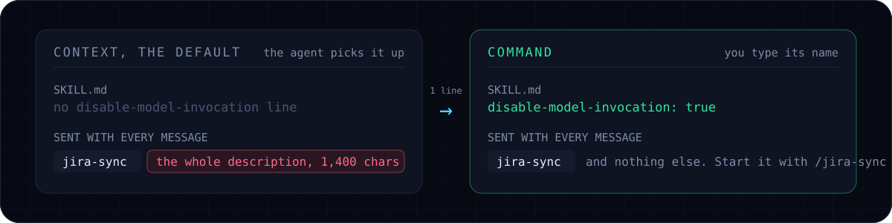

<p align="center">
  
</p>

<p align="center">
  <a href="https://github.com/steve-piece/token-coupons/actions/workflows/test.yml"></a>
  <a href="LICENSE"></a>
  
  
  
</p>

<p align="center">
  <a href="#install"><b>Install</b></a> ·
  <a href="#the-loop">How it works</a> ·
  <a href="#what-it-can-change-and-how-to-undo-it">What it changes</a> ·
  <a href="#every-tool-on-the-machine">Every tool</a> ·
  <a href="#privacy">Privacy</a>
</p>

Claude Code sends the name and description of every installed skill with every message you send. **token-coupons** reads your own chat history, finds the skills the agent has never used, prices what they cost you, and carries out your decisions with an undo line for each.

It reads Codex, Cursor and Gemini CLI too, so a skill you keep for another tool is never mistaken for dead weight.

<p align="center">
  
</p>

## What it tells you

Real output, from the author's machine on 2026-09-16, trimmed to fit:

```text
WHAT THE LISTING COSTS
  Skills in your listing: 119 (118 let the agent pick them, 1 starts only when you type its name)
  Allowance for the list: 40,000 characters, about 10,000 tokens (1 percent of a 1,000,000 token window)
  Sent with every message: about 14,517 tokens
  Over the allowance by 18,037 characters (1.45x). Past that line Claude Code drops descriptions
  quietly, least used first, so those skills cannot be found by the agent.

  86    never used, but described on every message  10,436 tokens per message
  24    cannot be reached (their description is being dropped to fit)
  4     only ever started by you typing their name    326 tokens per message

  Set those 90 skills to start only when you type their name and you save about 10,178 tokens
  on every message, and the list fits its allowance again.

WHAT IT COSTS IN DOLLARS
    model                     wasted/week  wasted/month  uncached/week  whole list/month
  * Claude Opus 5                  $22.73        $98.51        $147.83           $132.89
  * Claude Fable 5                 $45.47       $197.03        $295.65           $265.77
  * Claude Sonnet 5                 $9.09        $39.41         $59.13            $53.15
  * seen in your own sessions
  Assumes 136 messages per chat and 20.2 chats per week, measured from your sessions.
  On Claude Opus 5, the model you actually use, the unused descriptions cost about $22.73 a week
  ($98.51 a month).

RECOMMENDED
  29 to make a command, 12 to delete, 10 to rewrite (optimize), 68 to keep

   #  action    saves/msg  skill
   1  command         263  library-app-parity
       Never used in these sessions, yet its 1,051 chars description costs 269 tokens a message.
  10  delete          137  on-page-seo-auditor
       Never used, last edited 203 days ago, 547 chars sent every message.
  43  command          67  testing-skills-with-subagents
       Never used in these sessions, yet its 270 chars description costs 76 tokens a message.
       Used 1 time in Cursor, so keep the folder.
  52  keep              0  typescript-e2e-testing
       Claude Code never picked it on its own, but Cursor did (2 times) and reads the same
       setting, so gating it here would take it away there. Leave it.

OTHER TOOLS
  Codex
    In its list: 57 skills, about 6,731 tokens per message (room for about 5,168: 2 percent of a
    258400 token window, seen in its chats) over its allowance
    Chats read: 23 (2026-02-11 to 2026-03-23), 35 skill uses, 32 matched to a skill on disk
  Cursor
    In its list: 241 skills, about 23,102 tokens per message (it publishes no allowance)
    Chats read: 3,185 (2026-01-28 to 2026-09-15), 1,269 skill uses, 1,109 matched to a skill on disk
    read Cursor command line chats at ~/.cursor/projects (653)
    read Cursor app chats at ~/Library/Application Support/Cursor/User/globalStorage/state.vscdb (2,533)
  Gemini CLI
    In its list: 1 skill, about 58 tokens per message (it publishes no allowance)
    Chats read: 0, 0 skill uses, 0 matched to a skill on disk
    no Gemini CLI chats found under ~/.gemini/tmp
```

> [!NOTE]
> **Row 52 is worth a second look.** An earlier version of this excerpt had `typescript-e2e-testing` as its number one delete: never used, months untouched, the biggest description on the list. Cursor's agent had been reading it the whole time. Now that the report reads every tool on the machine, it stays.

Next, it hands you a page where every row is already set to what it recommends, you change the ones you disagree with, and it carries out your decisions.

<p align="center">
  
</p>

## Why this happens

Every skill carries a description. Claude Code puts a listing of every installed skill, name plus description, into the system prompt and re-sends it on **every single API call**. Two hundred skills means two hundred descriptions on every message of every chat, used or not.

That listing has a budget you never see: about 1 percent of the context window. When it overflows, Claude Code keeps every name and starts dropping **descriptions**, least-invoked first, until the rest fits. A skill with no description in the listing cannot be chosen by the agent at all.

It is installed. It is correct. It is unreachable. Nothing anywhere prints an error.

Three numbers follow, and the report leads with whichever is worst:

| The number | What it means |
| --- | --- |
| **Never called** | The agent has never chosen it, and its description still ships with every message |
| **Cannot be reached** | The listing is over its allowance and this description is one of the ones being dropped |
| **Summoned only** | It is used, but only when you type its name, so its description buys nothing |

## Install

```bash
npx skills add steve-piece/token-coupons
```

Then say `/token-coupons` in Claude Code. Node 20 or newer is the only requirement: no dependencies, no build step, no network.

<details>
<summary>Other ways in</summary>

```bash
# Claude Code plugin: this repo is a marketplace with one plugin
claude plugin marketplace add steve-piece/token-coupons
claude plugin install token-coupons@token-coupons
```

```bash
# from a clone, point your skills folder at the copy in this repo
git clone https://github.com/steve-piece/token-coupons
ln -s "$PWD/token-coupons/skills/token-coupons" ~/.claude/skills/token-coupons
```

</details>

## The loop


```mermaid
sequenceDiagram
  participant P as You
  participant A as Agent
  participant T as token-coupons
  A->>T: report
  T-->>A: summary + the decision page
  A->>P: one verdict line, then the page
  P->>P: change any row you disagree with
  P->>A: paste the decisions back
  A->>T: apply (plan first, then --yes)
  T-->>A: steps with undo lines, plus a rewrite worklist
  A->>A: draft the new descriptions
  A->>T: describe (plan first, then --yes)
  A->>T: report again, with the card
  T-->>P: before and after, and a scorecard to post
```

Nothing on disk changes while it waits for you. The agent runs `apply` without `--yes` first and shows you the plan, asks, then runs it.

## What it can change, and how to undo it

The tool sorts every skill into one of two kinds, and the whole job is deciding which kind each skill belongs in.

<p align="center">
  
</p>

| Kind | SKILL.md line | Sent every message |
| --- | --- | --- |
| **Context** (default) | none | name and full description; the agent picks it up as needed |
| **Command** | `disable-model-invocation: true` | name only; a workflow you start by typing its name |

| Action | When | What it does | Undo |
| --- | --- | --- | --- |
| `keep` | used, description a fair size | nothing | nothing |
| `command` | never used, or only started by name | adds the line, which Cursor reads too | delete the line |
| `context` | you want the agent picking it again | removes the line | add it back |
| `optimize` | used, but oversized or past the cap | queues it for `describe` | `cp` the copy `describe` kept |
| `delete` | never used in any tool, yours, untouched 90 days | unlinks the shortcut, or moves the folder to trash | `ln -s` or move it back |
| `review` | already a command, never used | nothing: pick one of the five above | nothing |

Nothing is unrecoverable. Shortcuts are unlinked rather than followed. Folders move to `~/.token-coupons/trash/<timestamp>` rather than being erased. A file about to have its description replaced is copied there first. Copies owned by the plugin cache are refused outright, with the `claude plugin uninstall` command to run instead. Every step prints its own undo line.

Rewriting a description is the one job that needs a model, so it is the one job the tool leaves to the agent. `apply` hands back a worklist, the agent drafts the words, and `describe` files them, replacing that one key and leaving every other line untouched.

## Every tool on the machine

Codex, Cursor and Gemini CLI each keep skills in their own folders, send their own listing with their own messages, and leave their chats on disk. token-coupons reads all of it. Every skill folder on the machine is a row, each row says which tools list it, and a use in any tool counts, so "never used" means never used anywhere.

| Tool | Skills read from | Chats read from | What counts as a use |
| --- | --- | --- | --- |
| **Claude Code** | `~/.claude/skills`, the project's `.claude/skills`, enabled plugins | `~/.claude/projects` | the Skill tool |
| **Codex** | `~/.codex/skills` and its bundled tier, `~/.agents/skills`, enabled plugins, `/etc/codex/skills` | `~/.codex/sessions` | a typed `$name`, or a command that reads the SKILL.md |
| **Cursor** | `~/.cursor/skills`, its bundled skills, `~/.agents/skills`, `~/.claude/skills` and `~/.codex/skills` as compatibility paths, installed plugins | `~/.cursor/projects`, plus the app's own chat database on Node 22.5 or newer | an attached skill or `/name`, or a read of the SKILL.md |
| **Gemini CLI** | `~/.gemini/skills`, extensions | `~/.gemini/tmp` | `activate_skill` |

Three rules follow:

- **A skill another tool has used is never proposed for deletion.**
- **A skill Cursor's agent picks on its own is never gated**, because Cursor reads the same `disable-model-invocation` line. Codex and Gemini CLI ignore it.
- **A tool whose chats could not be read is unknown, never zero.** That covers a tool with no history yet, or the Cursor app database on an older Node. A delete is held back for anything it lists.

Only Claude Code's list is priced. Each tool sends its own list with its own messages on its own model, so the report gives each tool its own line, with its own allowance where the tool publishes one, rather than adding them into a total that no single message ever carries.

## Where the numbers come from

- **Caching is priced the way Claude Code really runs it.** The listing sits at the front of the cached prefix, so it is paid at the cache-write rate whenever that prefix is invalidated (chat start, model switch, effort switch, or a gap longer than the cache lifetime) and at a tenth of input the rest of the time. A `/compact` is not one of those. How often it happens is measured from your own transcripts.
- **Messages per chat and chats per week are measured**, not assumed. When no history is found, the report says so instead of guessing.
- **On a subscription, dollars are the wrong unit**, so the report also gives the listing as a share of everything you send.
- **Prices are a data file** with a verified-on date, never code, and the report warns you when that date is more than 60 days old.

<details>
<summary>Two runs a week apart should be comparable</summary>

A report is only as steady as its inputs, and two of them change without you noticing: the folder you ran it from, which decides whose project skills count as listed, and how far back it read. So every run leaves a small record in `~/.token-coupons/runs`, and the next one reads it.

**Settings carry forward.** Ask for `--since=2026-06-01` once and every later report reads the same stretch of history without being told again. Anything you do type wins. Flags that only decide what gets written (`--html`, `--card`, `--out`) are deliberately not remembered.

**The report says what moved.** A `SINCE YOUR LAST RUN` block appears when the folder changed, skills came or went, or a headline number moved by more than a fifth. Silence there means the two runs measured the same thing.

`--fresh` skips both. History is thirty records deep, about 7 KB each, and it lives outside the skill folder on purpose: a plugin update replaces the plugin cache and `skills update` re-copies an installed skill, so history kept there would be wiped by the very event it exists to survive.

</details>

## Driving it yourself

Everything the skill runs is a command you can run.

```bash
TC() { node "$HOME/.claude/skills/token-coupons/bin/token-coupons.mjs" "$@"; }

TC report                                  # print it, change nothing
TC report --html=report.html --open        # the decision page
TC report --card=scorecard.html --open     # the shareable card, exports itself as a PNG
TC apply decisions.json                    # the plan, writes nothing
TC apply decisions.json --yes              # make the changes
```

`apply -` and `describe -` read the same JSON from stdin, so `pbpaste | TC apply -` works too.

<details>
<summary>Full CLI reference</summary>

```text
token-coupons report [--since=YYYY-MM-DD] [--cwd=DIR] [--window=N] [--fraction=F] [--budget=CHARS]
                     [--pricing=FILE] [--uncached] [--cache-ttl=MIN] [--json] [--html=FILE]
                     [--card=FILE] [--out=FILE] [--open] [--no-color] [--fresh] [--runs=DIR]
token-coupons apply <decisions.json | -> [--yes] [--trash=DIR] [--json]
token-coupons describe <descriptions.json | -> [--yes] [--trash=DIR] [--json]
token-coupons pricing [--pricing=FILE] [--json]
token-coupons help

  --since=DATE     only read sessions on or after this day
  --cwd=DIR        count a project's own skills as listed from this folder (default: where you run it)
  --window=N       context window size in tokens, instead of reading it from your settings
  --fraction=F     share of the window the listing may use (default 0.01)
  --budget=CHARS   a fixed allowance in characters, which wins over --fraction
  --pricing=FILE   a price list to use instead of the bundled one
  --uncached       price the worst case, where nothing is cached
  --cache-ttl=MIN  minutes the saved prompt survives with no messages (default 60, the Claude
                   subscription behaviour; use 5 on a plain API key)
  --json           print JSON instead of text
  --html=FILE      also write the decision page
  --card=FILE      also write the shareable card
  --out=FILE       also write the report JSON
  --open           open the page in your browser after writing it
  --no-color       plain text without colors
  --fresh          ignore the last run: carry nothing forward, compare nothing
  --runs=DIR       where run history is kept (default ~/.token-coupons/runs)
  --yes            apply and describe only: actually make the changes
  --trash=DIR      apply and describe only: where deleted folders and replaced files go
```

`report` exits 0 when it finishes. `apply` and `describe` exit 1 if a step failed, 0 otherwise; refusals are not failures. An unknown flag or command exits 2.

</details>

## Privacy

- **Local files only.** Your skill folders, the chat history each tool already keeps on disk (every path is in [the table above](#every-tool-on-the-machine)), and each tool's own config, for which plugins are on and which model you run. A tool whose folder is not on the machine is not looked for.
- **No network access, ever.** Prices ship as a data file with a date on them; refreshing them is a human action, not a fetch.
- **`report` writes nothing** beyond the paths you give it and its own run record.
- Set `TOKEN_COUPONS_HOME` to point the whole tool at a different home directory.

## Contributing

```bash
pnpm test                    # node --test, no dependencies to install
node tests/dash-scan.mjs     # fails on any em dash or en dash in the repo
```

The whole tool is `skills/token-coupons`, and `tests/` at the repo root reaches into it. Nothing the tool needs at runtime may live outside that directory: `skills add` copies it on its own, and anything left behind would simply be missing. [docs/architecture.md](docs/architecture.md) is the contract every module is written against; change it there first.

One rule that trips everyone up: no em dashes or en dashes anywhere in this repo, including code, comments, strings, docs, and generated HTML. Run the dash scan before you open a pull request.

## License

MIT. See [LICENSE](LICENSE).
